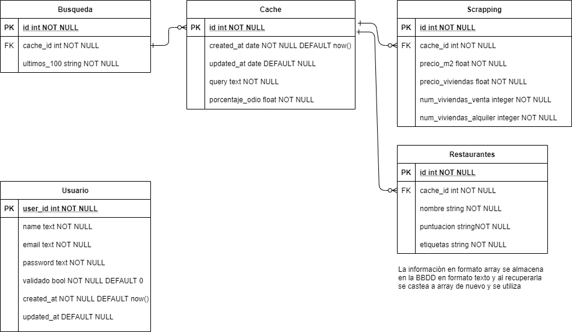
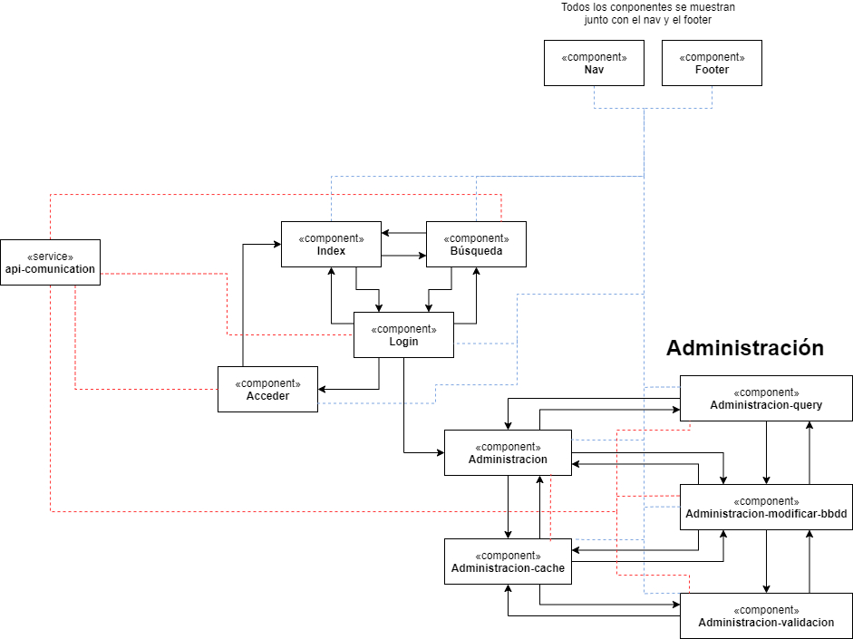

<h1>SpotScout
</h1>This project delivers a web interface built with Angular to explore housing prices across different neighborhoods, combining real estate data with machine learning and natural language processing.
- Prediction and visualization of housing prices by area, powered by machine learning models trained on up-to-date datasets.
- Real-time sentiment analysis on posts referencing various neighborhoods, retrieved via the X (Twitter) API, to uncover the community’s perception of each district.
- A modern, interactive front end enabling you to compare neighborhoods, review historical trends, and uncover key insights from both “hard” data and public sentiment.

  
<h1>BBDD</h1>

<h1>Components</h1>

# Color palette
https://colorhunt.co/palette/1c658c398ab9d8d2cbeeeeee

## Development server

Run `ng serve` for a dev server. Navigate to `http://localhost:4200/`. The app will automatically reload if you change any of the source files.

## Code scaffolding

Run `ng generate component component-name` to generate a new component. You can also use `ng generate directive|pipe|service|class|guard|interface|enum|module`.

## Build

Run `ng build` to build the project. The build artifacts will be stored in the `dist/` directory.
